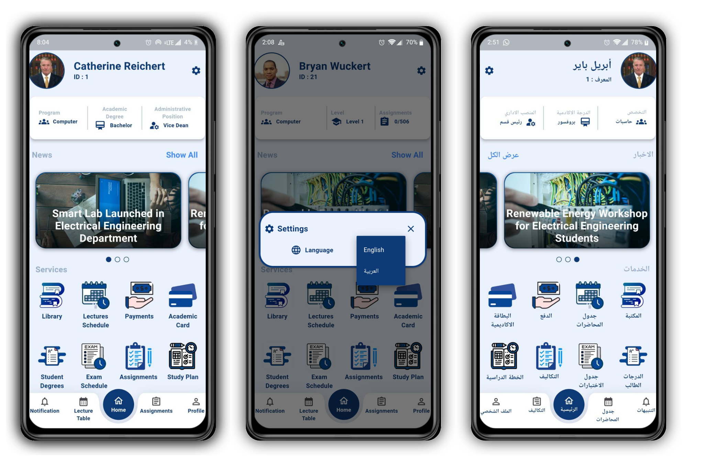
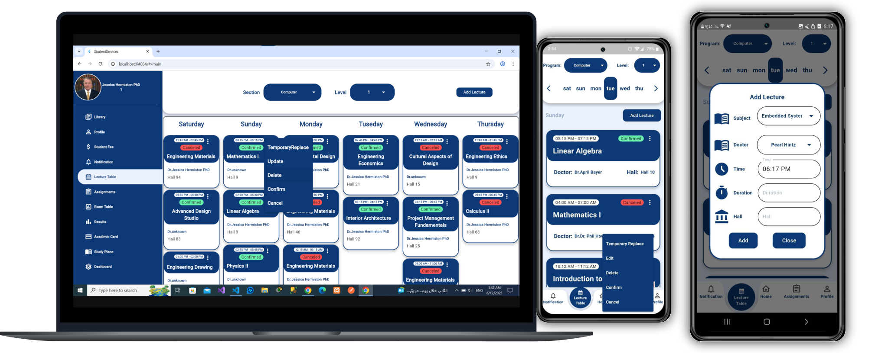
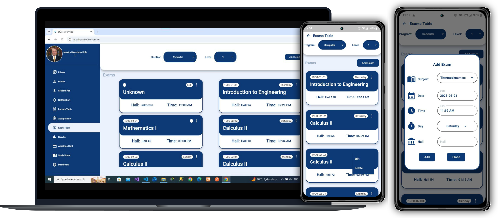
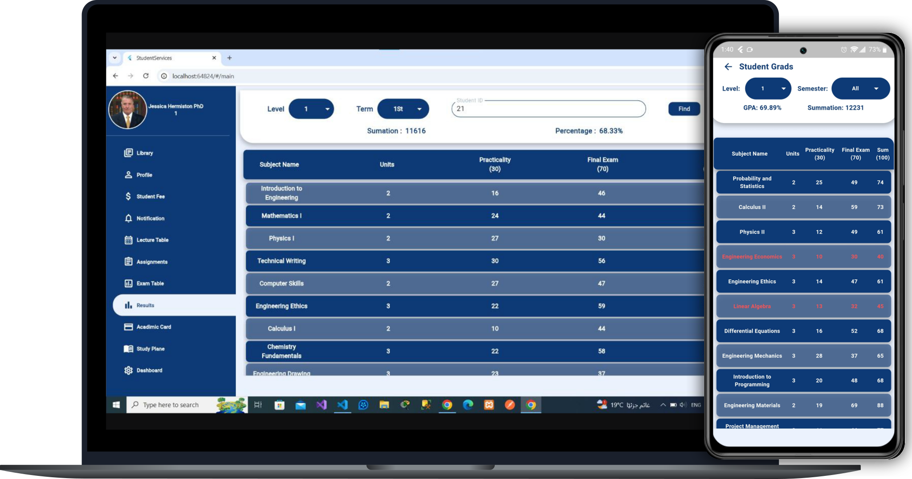
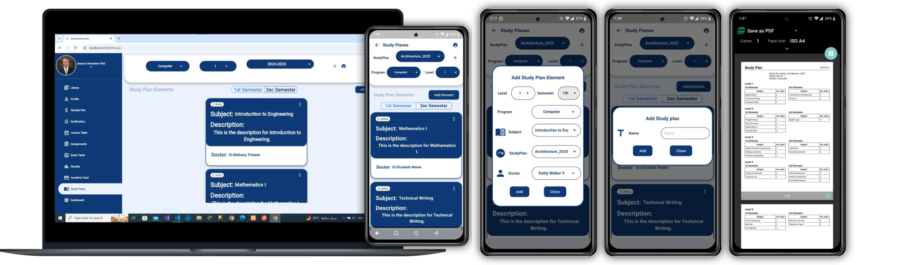
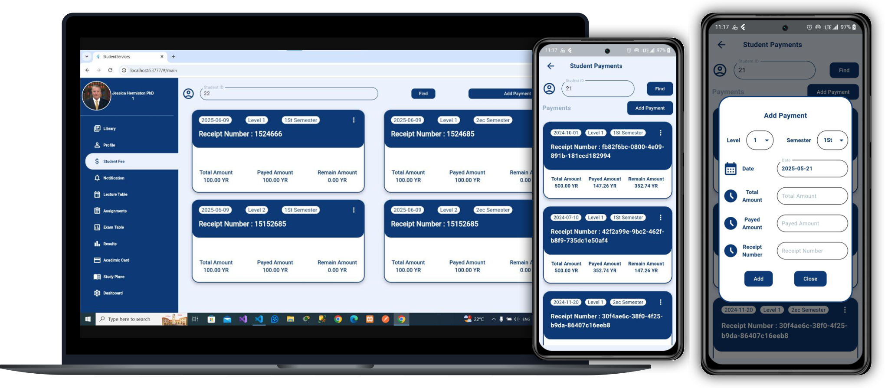
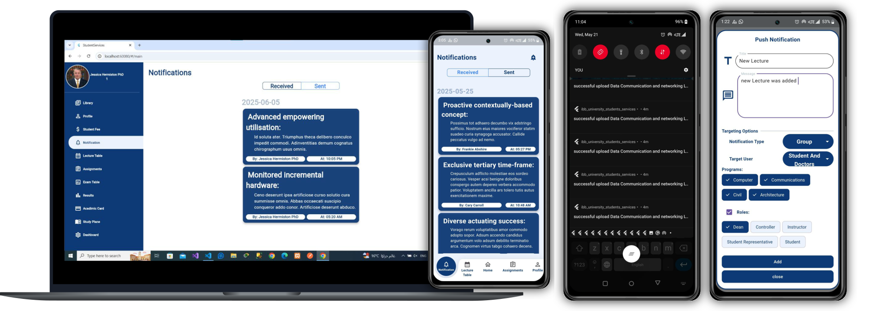
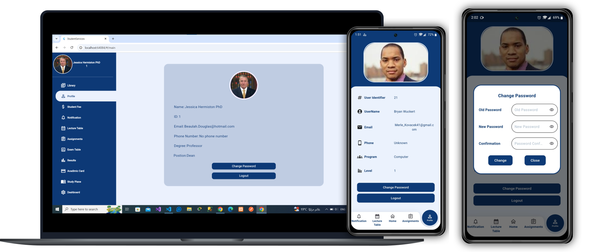
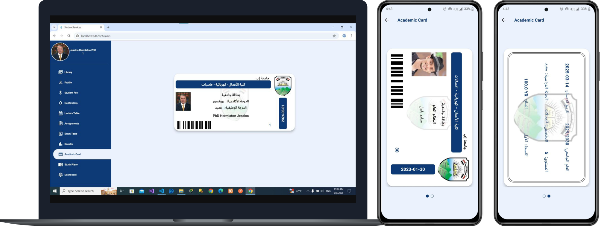
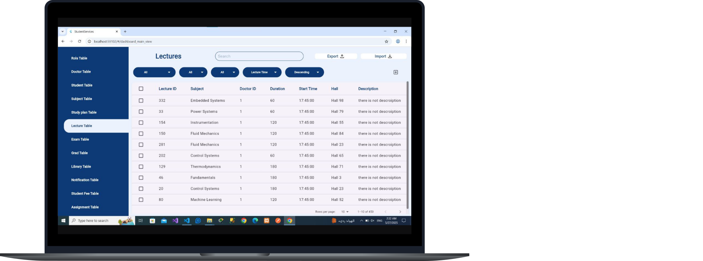

# Student Services System

## Overview

Student Services System is a graduation project developed to simplify and digitize university academic services. The platform provides students with a single application to access academic information and university resources, while offering administrators tools to manage content and services efficiently.

The project consists of:

- Flutter mobile application
- Web administration panel
- REST API backend
- MySQL database

## Features

### Student

- User authentication
- Student profile
- Course information
- Lecture schedules
- Assignments
- Exam schedules
- Grades
- Digital library
- News
- Notifications

### Administration

- Student management
- Course management
- Assignment management
- Examination management
- Grade management
- Library management
- News publishing

## Screenshots

### Authentication

The application provides secure authentication for students.

  

---

### Home

The dashboard provides quick access to the most important university services.

  

---

### Academic Services

Students can access lectures, assignments, examinations, and grades from one place.

| Lectures | Assignments |
|---------|-------------|
|  |  |

| Exams | Grades |
|-------|--------|
|  |  |

| Stady Plane | Payments |
|-------|--------|
|  |  | 

---

### Digital Library

Students can browse books and educational resources.

 

---

### News & Notifications

| News | Notifications |
|------|----------------------|
|  |  |

---

### Student Profile & ID Card

Students can view and manage their personal information.

| Profile | Student ID |
|---------|------------|
|  |  |

## Admin Web Panel

The administration panel enables administrators to manage university data through a responsive web interface.

## Technology Stack

### Frontend

- Flutter
- Dart
- GetX

### Backend

- Node.js
- Express.js
- Sequelize ORM

### Database

- MySQL

## Future Improvements

- Offline synchronization
- Push notifications
- Multi-language support

## Team

| Name | Role |
|------|------|
| Shehab Derhem Mohammed Al-Saidi | FrontEnd (Mobile Screens) & Team Leader |
| Ahmed Dahan Aljbri | BackEnd & API |
| Hameed Najeeb Antar | DataBase Design |
| Mohammed Bazarah | Web Screens |

## License

This project was developed as a university graduation project for educational purposes.
